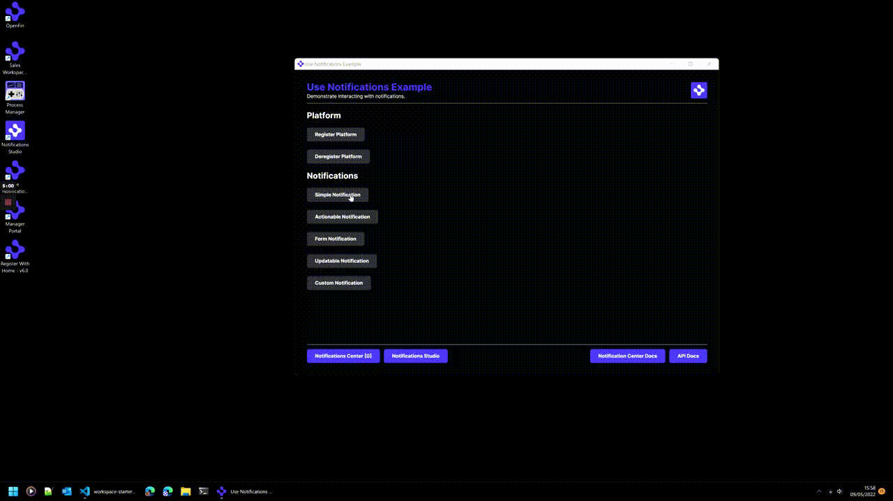

> **_:information_source: HERE Core UI:_** [HERE Starter](https://resources.here.io/docs/core/hc-ui/) is a commercial product and this repo is for evaluation purposes (See [LICENSE.MD](LICENSE.MD)). Use of the HERE Core Container and HERE Core UI components is only granted pursuant to a license from HERE (see [manifest](public/manifest.fin.json)). Please [**contact us**](https://www.here.io/contact) if you would like to request a developer evaluation key or to discuss a production license.

# Use Notifications

HERE Notifications allow your applications to display and interact with notifications in a common environment.

This application you are about to install is a simple example of plugging in your own content or app. This example assumes you have already [set up your development environment](https://resources.here.io/docs/core/develop/)

The example is a simple view that shows launching, interacting and auditing notifications.

## Running the Sample

To run this sample you can:

- Clone this repo and follow the instructions below. This will let you customize the sample to learn more about our APIs.


## Getting Started

1. Install dependencies and do an initial build. Note that these examples assume you are in the sub-directory for the example.

```shell
npm run setup
```

2. Start the test server in a new window.

```shell
npm run start
```

4. Start the demonstration application.

```shell
Run the Enterprise Browser platform
Add a new web app and set its url to http://localhost:8000/platform/provider.html
Provide a valid name and ID
Assign the appropriate users
Publish your changes, quit EB and restart
In a new tab in the search box type the name that you gave the application and launch it.
```

5. Build the project if you change the code.

```shell
npm run build
```



---
