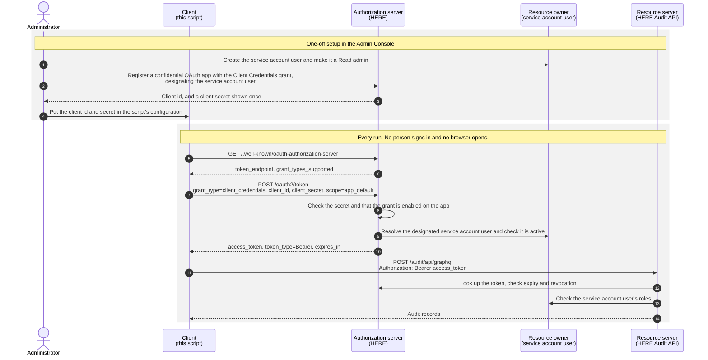

> **_:information_source: HERE:_** [HERE](https://www.here.io) is a commercial product and this repo is for evaluation purposes. Use of HERE Core and HERE Enterprise Browser is only granted pursuant to a license from [HERE](https://www.here.io) (OpenFin). Please [**contact us**](https://www.here.io/contact) if you would like to request a developer evaluation or to discuss a production license.

# How To Use OAuth Client Credentials

This example shows how a headless service, such as a scheduled job, a CI pipeline or a SIEM collector, calls HERE Cloud APIs using the **OAuth 2.0 client credentials grant** introduced in HERE 15.

It does two things:

- `npm run check` walks the whole flow once against your environment and reports each step: discovery, token, API call.
- `npm run pull` is a working audit collector. Each run reads the next window of [Audit API](#the-audit-api) records and appends them to a newline-delimited JSON file that a log forwarder can pick up. Schedule it every 15 minutes and it will not skip or duplicate records between runs.

It has no runtime dependencies. OAuth and GraphQL are both plain `fetch` calls, so the code reads as a description of the protocol rather than of a library.

## Who is who in this flow

Client credentials is a **system-to-system** grant. No person signs in and no browser is involved. It is worth being precise about the four OAuth roles, because from the outside every OAuth flow ends the same way, with a bearer token.

| OAuth role                | In this example                                                                                                                                            |
| ------------------------- | ---------------------------------------------------------------------------------------------------------------------------------------------------------- |
| **Client**                | This script, registered in the Admin Console as a _confidential_ OAuth app. It holds the client id and secret.                                             |
| **Authorization server**  | HERE. Your HERE domain issues the token at `/oauth2/token`. No other identity provider is involved.                                                        |
| **Resource server**       | The HERE Cloud API being called, here the Audit API at `/audit/api/graphql`.                                                                               |
| **Resource owner (user)** | None at run time. Instead an administrator chooses a **service account user** when registering the app, and every token the app obtains acts as that user. |



The resource owner is the role most easily misread. In an authorization code flow it is a person who signs in and approves access at that moment. Here the approval happens once, at setup, when an administrator registers the app and designates the service account user. The service account never signs in; it is the identity every token carries, because HERE applies permissions to users. That is why a token from this flow can look user-delegated from the outside, and why the service account should be a dedicated user rather than a person's own login.

Because the token acts as the service account user, **that user's roles decide what the token can reach**. Each Cloud API checks the service account's roles on every call, so give the service account only the role it needs.

If you want an application to act **as the person using it**, for example a web page that signs a user in, that is the authorization code grant with PKCE, a different flow. See [How To Use The GraphQL API For App and User Management](../use-graphql-for-management/) for an example of that.

## Before you start

- Your HERE environment must be on **HERE 15** or later. `npm run check` tells you: if discovery does not list `client_credentials`, the environment is on an earlier version.
- You need an administrator login to the Admin Console.
- Node.js 22.22.2 or later.

## Setting up the OAuth app

### 1. Create the service account user

Create a dedicated user for the integration rather than using a person's account. A named person's account makes the audit trail read as if that person made each call, and the integration breaks when they leave.

In the Admin Console, go to **Access > Users**, choose **Create New User** and create a user whose username identifies the integration, for example `svc-audit-collector` or an email-style address your organisation reserves for service accounts. The user must be **active**.

The **Service Account User** picker lists only active users. If the user is later deactivated, token requests fail with `invalid_grant`.

### 2. Give it only the role it needs

For the Audit API the service account needs read-only admin access.

1. Go to **Admin > Admin Settings** and choose **Add Admin Users**.
2. Tick the service account in the **Non-Admins** list, then choose **Select Admin Type**.
3. Choose **Read: all apps, all admin tabs**, then **Add Admins**.

The service account now appears in the **Admin Security** list with an **Admin Type** of Read, alongside your human administrators. That list is where to review what access it holds.

### 3. Register the OAuth app

1. Go to **Admin > OAuth Apps** and choose **Register OAuth App**.
2. Give it a name and description that say what it is, for example "Audit collector".
3. Choose **Confidential** as the client type. This cannot be changed later.
4. Under **Enabled Grants**, tick **Client Credentials** only.
5. Under **Service Account User**, search for and select the user from step 1.
6. Save, then copy the **Client ID**.

### 4. Create a client secret

On the app, add a secret. Give it a name and an expiry (90 days by default, and no more than a year). **The secret is shown once**, so copy it straight into your secret store.

Plan for the expiry. When the secret expires, token requests fail with `invalid_client`. Apps can hold more than one secret, so rotate by adding the new secret, switching the collector over, then removing the old one.

## Running the example

From the root of the repo run `npm install` (or `npm run setup` from this folder), then in this folder:

```bash
cp .env.example .env
# edit .env: BASE_URL, HERE_CLIENT_ID, HERE_CLIENT_SECRET
npm run check
```

A successful check looks like this:

```text
1. Reading OAuth metadata from https://my-org.here.io
   token endpoint: https://my-org.here.io/oauth2/token
   grants supported: authorization_code, refresh_token, client_credentials
2. Requesting an access token with the client credentials grant
   token_type: Bearer
   expires_in: 900s
   scope:      full
3. Calling the Audit API as the app's service account
   OK: 1234 audit records visible to this app.
```

The check prints the token's metadata but never the token itself. `expires_in` is set by your environment, so yours may differ.

Then pull records:

```bash
npm run pull
```

Records are appended to `output/audit-YYYY-MM-DD.ndjson`, one JSON object per line and one file per UTC day, and the position reached is saved in `output/state.json`. Run it again and it carries on from there.

## How the collector works

**Tokens.** The client sends its id and secret in the form body (`client_secret_post`) with `scope=app_default`. The client credentials grant does not return a refresh token, so when the access token is about a minute from expiry the collector simply asks for a new one. See [`src/oauth.ts`](./src/oauth.ts).

**Windows.** Each run reads from the saved watermark to a point 60 seconds behind now, oldest first, 100 records a page. The small lag gives records that are still being written time to land before their window is read. HERE does not keep a watermark for you, so the collector stores its own. See [`src/pull-audit.ts`](./src/pull-audit.ts).

**No gaps, no duplicates.** The Audit API treats both ends of a window as inclusive, so consecutive windows share their boundary instant. Each run starts exactly where the last one stopped, so nothing falls between windows, and remembers the ids of records on the boundary so the next run does not write them twice.

**Failures.** Nothing is written until the whole window has been read, and the watermark only moves after the records are written. If a run fails, it leaves no partial output and the next scheduled run retries the same window.

**Scheduling.** Run `npm run pull` from cron, a systemd timer, Windows Task Scheduler or your job orchestrator, every 15 minutes for example. Point your log forwarder at the `output` folder, or change `AUDIT_OUTPUT_DIR`.

## Security notes

**How HERE holds the credentials.** A secret is displayed once, when it is created, and cannot be retrieved afterwards. Access tokens are opaque strings, not JWTs, so they carry no readable claims, and HERE checks each one on every call, including its expiry and whether it has been revoked. The secret is only ever sent to the token endpoint, and the token only to the API, both over HTTPS.

**Token lifetime.** The access token lifetime is set for the HERE environment, not per app, and each token response states it in `expires_in`. The lifetime setting on an OAuth app in the Admin Console is the refresh token lifetime, which does not apply here because this grant issues no refresh token.

**What the token can reach.** The token is not limited to particular APIs by scope. Each Cloud API checks the service account's roles, so least privilege is set through the admin type you give it. The Read admin type is read-only, and its read access covers administration data generally, not only the Audit API. The token does not reach your own applications or their data, which sit behind their own authentication.

**The app cannot sign a person in.** Grants are enabled per app. An app with only the Client Credentials grant enabled cannot be used for the browser sign-in flow.

**Withdrawing access.** Each option has a different effect:

- Deleting a client secret stops new tokens being issued with it. Tokens already issued remain valid until they expire.
- Deactivating the service account user stops new tokens being issued to the app. Tokens already issued remain valid until they expire.
- Deleting the OAuth app removes it together with every token issued to it, so the next API call is rejected.

HERE does not provide a token revocation endpoint (RFC 7009) or an introspection endpoint (RFC 7662).

**Audit trail of the setup.** Creating, changing and deleting an OAuth app, and adding and removing its secrets, are recorded in the Audit API, so this collector reports changes to its own registration. Issuing a token is not recorded.

## The Audit API

The Audit API returns the changes administrators make in the Admin Console, for example to users, groups, content, configuration, Supertabs, integrations, API keys, permissions, administrators, roles and OAuth apps. Each record carries who made the change, when, what kind of change it was, and the before and after values in `metadata`.

It records administration changes, including changes to OAuth apps and their secrets. It does not record sign-ins, sessions or browsing activity. The collector does not filter on `actorType`, so records created by HERE's own processes are included alongside those made by administrators.

## Troubleshooting

| What you see                                 | What to check                                                                                                  |
| -------------------------------------------- | -------------------------------------------------------------------------------------------------------------- |
| Discovery does not list `client_credentials` | The environment is on a version earlier than HERE 15.                                                          |
| `invalid_client`                             | The client id or secret is wrong, or the secret has expired.                                                   |
| `unauthorized_client`                        | The Client Credentials grant is not enabled on the app.                                                        |
| `invalid_scope`                              | The token request must send `scope=app_default` and nothing else. The example already does.                    |
| `invalid_grant`                              | The app has no service account user, or that user is no longer active.                                         |
| HTTP 403 or `FORBIDDEN` from the API         | The token is fine but the service account lacks access. Make it a Read admin under **Admin > Admin Settings**. |

## Notes

- Do not send an `x-of-auth-id` header with these tokens. That header selects between identity providers configured for your organisation, and HERE validates the tokens it issues itself.
- If you have used an API JWT from your own identity provider to call HERE APIs, client credentials replaces it. The service account and its role work the same way, only the way the token is obtained changes.
- The token is not specific to the Audit API. `ClientCredentialsTokenSource` in [`src/oauth.ts`](./src/oauth.ts) can supply a bearer token for any HERE Cloud API the service account's role permits, for example the app directory and user and group GraphQL API at `/here/api/graphql` used in [How To Use The GraphQL API For App and User Management](../use-graphql-for-management/). The Read admin type is read-only, so a service account that makes changes needs an admin type that grants write access to the data it changes.
- The client credentials grant never returns a refresh token. Refresh tokens in HERE 15 belong to the authorization code grant, where an app requests the `offline_access` scope.

---

### Read more about working with HERE

[HERE Enterprise Browser](https://www.here.io/)
